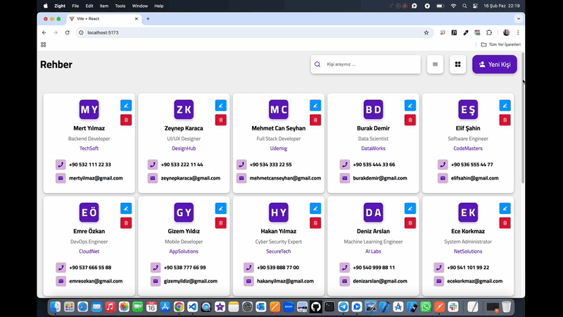

# Rehber Project 👤

<li>Bu proje React,Vite,Scss,Axios,Apı,Json-Server,React-Icons ile oluşturulmuş Rehber uygulaması site arayüzü içerir.</li>
<li>Rehber uygulamasında yeni kişi ekleme,kişiyi güncelleme ve silme özelliğini barındırır.</li>
<li>Kullanıcı dostu responsive tasarımı mevcuttur.</li>

# Kullanılan Teknolojiler 🎨

<li>React</li>
<li>Vite</li>
<li>Scss</li>
<li>Axios</li>
<li>Apı</li>
<li>Json-Server</li>
<li>React-Icons</li>

# Ekran Görüntüsü 🎥
      

# İletişim 📩
yunusemreoral@hotmail.com.tr
